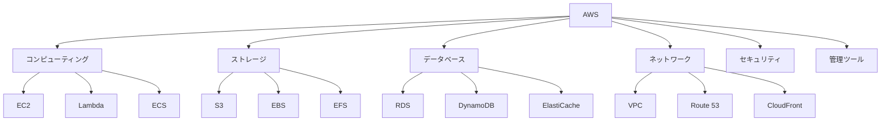
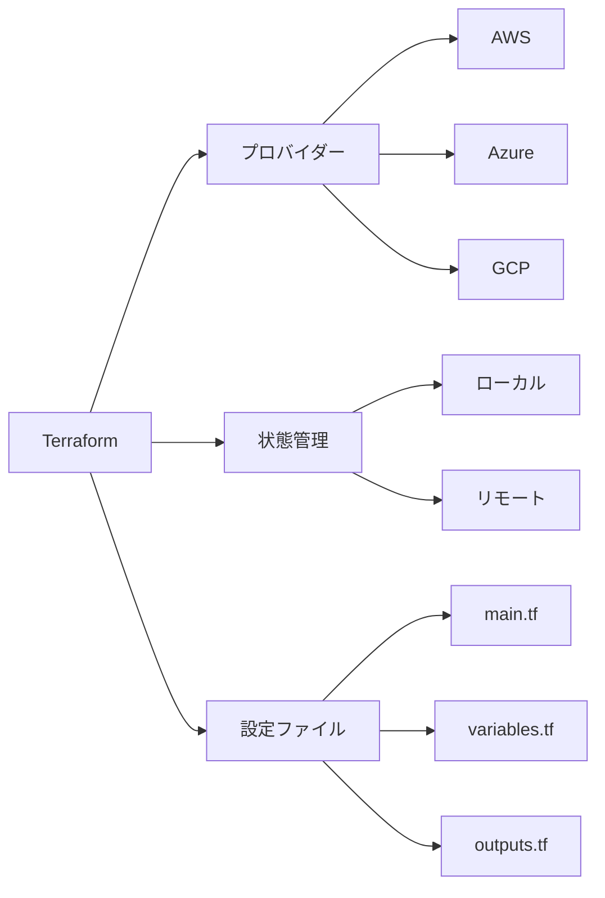
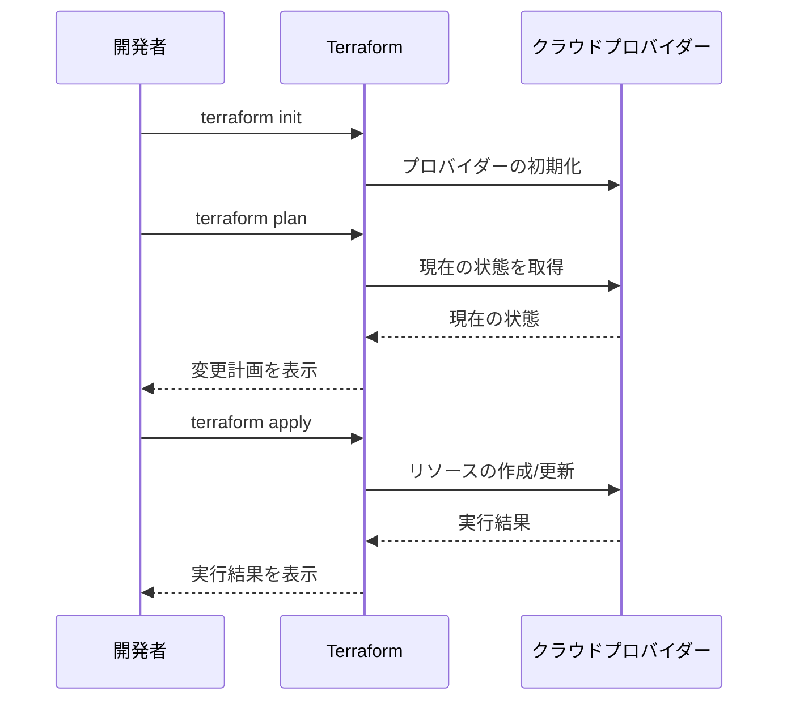

# AWSの概要とTerraform入門

## AWSとは

Amazon Web Services（AWS）は、Amazonが提供するクラウドコンピューティングサービスです。サーバー、ストレージ、データベース、ネットワーク、アプリケーションサービスなど、200以上のサービスを提供しています。

### AWSの全体像



### 主な特徴

- オンデマンドで利用可能
- 従量課金制
- グローバルなインフラストラクチャ
- 高いセキュリティ
- スケーラビリティ

### よく使用される主要サービス

1. **コンピューティング**
   - EC2 (Elastic Compute Cloud)
   - Lambda
   - ECS (Elastic Container Service)

2. **ストレージ**
   - S3 (Simple Storage Service)
   - EBS (Elastic Block Store)
   - EFS (Elastic File System)

3. **データベース**
   - RDS (Relational Database Service)
   - DynamoDB
   - ElastiCache

4. **ネットワーク**
   - VPC (Virtual Private Cloud)
   - Route 53
   - CloudFront

## Terraformとは

Terraformは、HashiCorp社が開発したインフラストラクチャ・アズ・コード（IaC）ツールです。AWS、Azure、GCPなどのクラウドプロバイダーのリソースを、コードで管理することができます。

### Terraformのアーキテクチャ



### Terraformの主な特徴

- 宣言的な設定
- 複数のクラウドプロバイダーに対応
- 状態管理
- モジュール化
- プラン機能

### Terraformの基本的な使い方

1. **インストール**

```bash
# macOSの場合
brew install terraform
```

2. **プロジェクトの初期化**

```bash
terraform init
```

3. **設定ファイルの作成**

```hcl
# main.tf
provider "aws" {
  region = "ap-northeast-1"
}

resource "aws_vpc" "main" {
  cidr_block = "10.0.0.0/16"

  tags = {
    Name = "example-vpc"
  }
}
```

4. **実行計画の確認**

```bash
terraform plan
```

5. **インフラの作成**

```bash
terraform apply
```

6. **インフラの削除**

```bash
terraform destroy
```

### Terraformのワークフロー



### Terraformの重要な概念

1. **プロバイダー**
   - AWS、Azure、GCPなどのクラウドプロバイダーを指定
   - 各プロバイダー固有のリソースやデータソースを利用可能

2. **リソース**
   - インフラストラクチャの構成要素（EC2インスタンス、VPC、S3バケットなど）
   - リソースタイプとリソース名で定義

3. **データソース**
   - 既存のリソースの情報を取得
   - リソースの参照や条件分岐に使用

4. **変数**
   - 設定値を外部化
   - 環境ごとの設定変更が容易

5. **出力**
   - 作成したリソースの情報を出力
   - 他のモジュールやスクリプトで利用可能

### ベストプラクティス

1. **状態管理**
   - リモート状態の使用（S3 + DynamoDB）
   - 状態ファイルのバージョン管理

2. **モジュール化**
   - 再利用可能なコードの作成
   - 環境ごとの設定分離

3. **命名規則**
   - 一貫性のある命名
   - 環境や用途を反映した名前付け

4. **セキュリティ**
   - 機密情報の管理（AWS Secrets Manager等）
   - 最小権限の原則

## 次のステップ

次の章では、実際にAWSの主要なサービスを使用して、基本的なインフラストラクチャを構築していきます。VPC、EC2、RDSなどの基本的なリソースの作成と管理方法を学びます。
