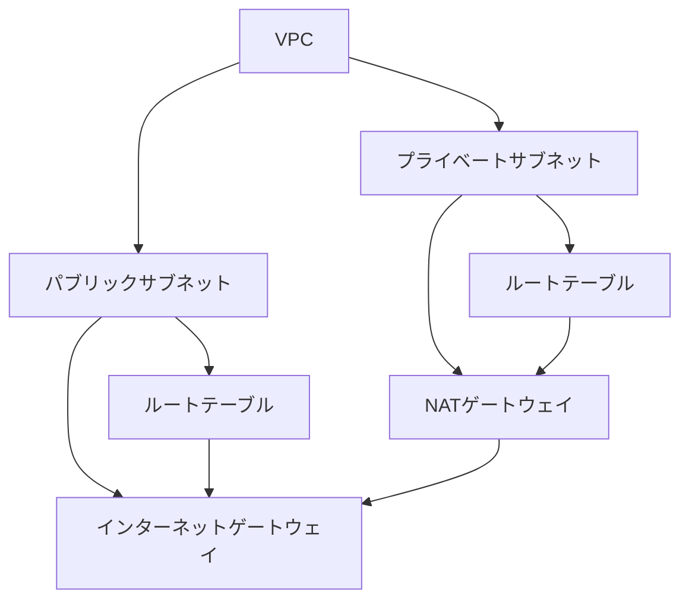
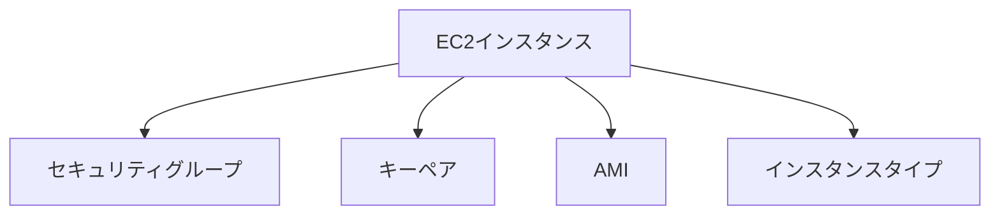
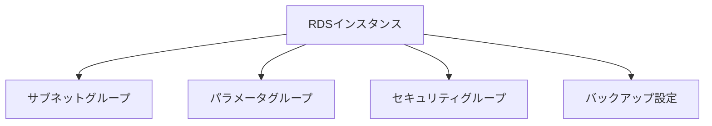

# AWSの基本的なインフラストラクチャ構築

## VPCの構築

VPC（Virtual Private Cloud）は、AWSクラウド内の仮想ネットワークです。VPCを使用することで、AWSリソースを論理的に分離し、セキュアな環境を構築できます。

### VPCの基本構成



### VPCの作成

```hcl
# vpc.tf
resource "aws_vpc" "main" {
  cidr_block           = "10.0.0.0/16"
  enable_dns_support   = true
  enable_dns_hostnames = true

  tags = {
    Name = "main-vpc"
  }
}

# パブリックサブネット
resource "aws_subnet" "public" {
  vpc_id                  = aws_vpc.main.id
  cidr_block              = "10.0.1.0/24"
  availability_zone       = "ap-northeast-1a"
  map_public_ip_on_launch = true

  tags = {
    Name = "public-subnet"
  }
}

# プライベートサブネット
resource "aws_subnet" "private" {
  vpc_id            = aws_vpc.main.id
  cidr_block        = "10.0.2.0/24"
  availability_zone = "ap-northeast-1a"

  tags = {
    Name = "private-subnet"
  }
}

# インターネットゲートウェイ
resource "aws_internet_gateway" "main" {
  vpc_id = aws_vpc.main.id

  tags = {
    Name = "main-igw"
  }
}

# NATゲートウェイ
resource "aws_nat_gateway" "main" {
  allocation_id = aws_eip.nat.id
  subnet_id     = aws_subnet.public.id

  tags = {
    Name = "main-nat"
  }
}

# Elastic IP for NAT Gateway
resource "aws_eip" "nat" {
  domain = "vpc"
}

# パブリックルートテーブル
resource "aws_route_table" "public" {
  vpc_id = aws_vpc.main.id

  route {
    cidr_block = "0.0.0.0/0"
    gateway_id = aws_internet_gateway.main.id
  }

  tags = {
    Name = "public-rt"
  }
}

# プライベートルートテーブル
resource "aws_route_table" "private" {
  vpc_id = aws_vpc.main.id

  route {
    cidr_block     = "0.0.0.0/0"
    nat_gateway_id = aws_nat_gateway.main.id
  }

  tags = {
    Name = "private-rt"
  }
}
```

## EC2インスタンスの作成

EC2（Elastic Compute Cloud）は、AWSの仮想サーバーサービスです。

### EC2インスタンスの基本構成



### EC2インスタンスの作成

```hcl
# ec2.tf
resource "aws_instance" "web" {
  ami           = "ami-0c3fd0f5d33134a76"  # Amazon Linux 2
  instance_type = "t2.micro"
  subnet_id     = aws_subnet.public.id

  vpc_security_group_ids = [aws_security_group.web.id]
  key_name              = aws_key_pair.main.key_name

  tags = {
    Name = "web-server"
  }
}

# セキュリティグループ
resource "aws_security_group" "web" {
  name        = "web-sg"
  description = "Security group for web server"
  vpc_id      = aws_vpc.main.id

  ingress {
    from_port   = 80
    to_port     = 80
    protocol    = "tcp"
    cidr_blocks = ["0.0.0.0/0"]
  }

  ingress {
    from_port   = 22
    to_port     = 22
    protocol    = "tcp"
    cidr_blocks = ["0.0.0.0/0"]
  }

  egress {
    from_port   = 0
    to_port     = 0
    protocol    = "-1"
    cidr_blocks = ["0.0.0.0/0"]
  }

  tags = {
    Name = "web-sg"
  }
}

# キーペア
resource "aws_key_pair" "main" {
  key_name   = "main-key"
  public_key = file("~/.ssh/id_rsa.pub")
}
```

## RDSの作成

RDS（Relational Database Service）は、AWSのマネージドデータベースサービスです。

### RDSの基本構成



### RDSインスタンスの作成

```hcl
# rds.tf
resource "aws_db_subnet_group" "main" {
  name       = "main-db-subnet-group"
  subnet_ids = [aws_subnet.private.id]

  tags = {
    Name = "main-db-subnet-group"
  }
}

resource "aws_security_group" "db" {
  name        = "db-sg"
  description = "Security group for RDS"
  vpc_id      = aws_vpc.main.id

  ingress {
    from_port       = 3306
    to_port         = 3306
    protocol        = "tcp"
    security_groups = [aws_security_group.web.id]
  }

  tags = {
    Name = "db-sg"
  }
}

resource "aws_db_instance" "main" {
  identifier           = "main-db"
  engine              = "mysql"
  engine_version      = "8.0"
  instance_class      = "db.t3.micro"
  allocated_storage   = 20
  storage_type        = "gp2"
  
  db_name             = "mydb"
  username            = "admin"
  password            = "your-password"  # 本番環境では変数を使用
  
  vpc_security_group_ids = [aws_security_group.db.id]
  db_subnet_group_name   = aws_db_subnet_group.main.name
  
  backup_retention_period = 7
  skip_final_snapshot    = true

  tags = {
    Name = "main-db"
  }
}
```

## インフラストラクチャのデプロイ

1. **Terraformの初期化**

```bash
terraform init
```

2. **実行計画の確認**

```bash
terraform plan
```

3. **インフラの作成**

```bash
terraform apply
```

4. **インフラの削除**

```bash
terraform destroy
```

## セキュリティのベストプラクティス

1. **ネットワークセキュリティ**
   - 最小限のポート開放
   - セキュリティグループの適切な設定
   - プライベートサブネットの活用

2. **データベースセキュリティ**
   - 強力なパスワードポリシー
   - 暗号化の有効化
   - バックアップの設定

3. **インスタンスセキュリティ**
   - 最新のAMIの使用
   - セキュリティパッチの適用
   - キーペアの適切な管理

## 次のステップ

次の章では、より高度なAWSサービスの使用方法について学びます。ロードバランサー、Auto Scaling、CloudFrontなどのサービスを使用して、スケーラブルで高可用性なインフラストラクチャを構築する方法を解説します。
