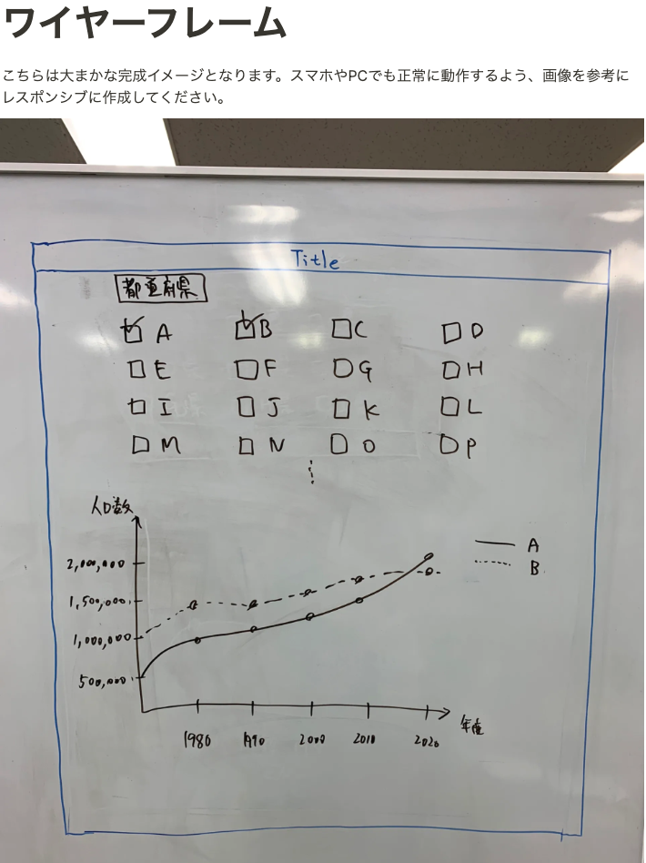
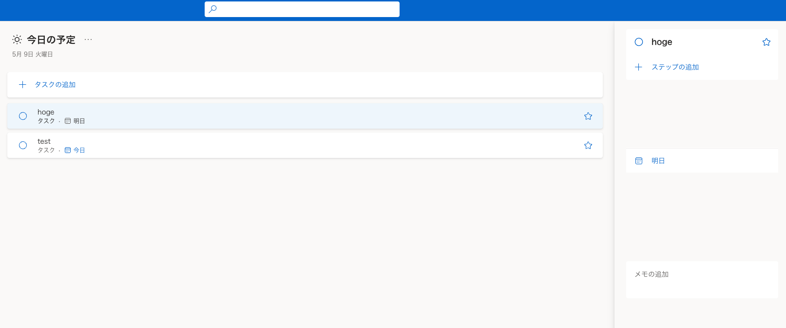
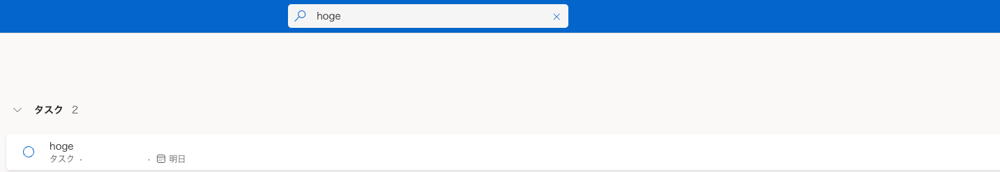

# Subject

[Back to README](/README.md)

[Back to Previous Chapter](/Chap3.md)

研修修了課題として、バックエンド/フロントエンド別にそれぞれ課題を用意しました．

## フロントエンド

都道府県別の総人口推移グラフを表示するSPA(Single Page Application)を構築してください．



### 内容

1. RESAS(地域経済分析システム) APIの「都道府県一覧」APIから取得する
2. APIレスポンスから都道府県一覧のチェックボックスを動的に生成する
3. 都道府県にチェックを入れると、RESAS APIから選択された都道府県の「人口構成」を取得する
4. 人口構成APIレスポンスから、X軸:年、Y軸:人口数の折れ線グラフを動的に生成して表示する
5. 「総人口」の他に「年少人口」「生産年齢人口」「老年人口」も切り替えるUIを何らかの形で用意し表示できるようにすること（同時に表示する必要はない）

### 制約

- 都道府県一覧および総人口情報はRESAS APIのデータを用いること
- APIからデータを取得する際は、HTTPリクエストの作成機能を有した axios など、任意のツールを使用してもよい
- グラフは Highcharts や Rechart.js などのサードパーティ製のグラフライブラリを用いて描画すること
(ただし、グラフライブラリは上記のものに限らず、任意のものを用いてよい)
- Google Chrome最新版で正しく動くこと
- PC/スマートフォン表示に対応すること(レスポンシブデザイン対応) ただし実機でなく、Google Chromeの検証ツールで確認できればよい
- リンターやフォーマッターを適切に設定すること
- リンターにはESLint、フォーマッターにはPrettierを使用すること
- TypeScriptで記述すること
- テストケース/テストコードを作成すること
- テストツールは任意のものを用いてよい
- テスト実行時にエラーが発生しないこと
- ソースコードはGitで管理し、作成したソースコードはGitHubにアップロードすること
- Netlify / GitHub Pages / Firebase hosting / Vercel 等のホスティングサービスにデプロイし、インターネット経由で閲覧できる状態にし、そのURLを提出時に共有すること

### 注意事項

- RESAS APIの利用登録(無料)を行い、API Keyを発行すること
- セキュリティを考慮してコードを記述すること
- アプリのコンポーネント粒度の設計、Gitコミットメッセージやコミット粒度、ドキュメンテーション等もレビュー対象となる、チーム開発を意識してコードを記述すること

参考

- [RESAS](https://opendata.resas-portal.go.jp/)
- [RESAS API仕様書](https://opendata.resas-portal.go.jp/docs/api/v1/index.html)
- [Recharts.js](https://recharts.org/en-US)

## バックエンド

### 技術要件

- API -> FastAPI (poetry管理)
- DB -> お好みのDBを使用してください。sqlite3でも可能

### 実装内容



作成してもらうのは上のような簡単なTODOアプリです(APIの部分のみでHTML&CSSは不要)

1. ユーザーはTODOリストを追加することができる。(認証機能は無し)
    1. TODOリストにはタイトルと締切、メモを追加することができる。
    2. TODOリストにはそれぞれ、子タスク(図中ではステップ)を作成することができる。子タスクはその下に子タスクを持つことはできない。子タスクには、名前だけを持たせる。
2. タスクは古い順に上から並べて表示する。
3. ユーザーは上の検索ボタンからタスクの名前で検索を行うことができる。
4. TODOリストのデータはDBに保存されている。



参考にしたのはMicroSoftのTODOリストです。機能を絞ってありますが、もしも動作を確認したい場合は、以下のリンクからアクセスできます。
もしも要件でわからないところがあれば参考にしてください。

- [to-do.live.com](https://to-do.live.com/tasks)

### 制約条件

- FastAPIやDjango Rest FrameworkなどChap2で学習したフレームワークを使用して作成すること．
- リンターやフォーマッターを適切に設定すること
- リンターにはflake8、フォーマッターにはblackを使用すること
- なるべくTypeHintが記述されていること
- テストケース/テストコードを作成すること
- テストツールは任意のものを用いてよい
- テスト実行時にエラーが発生しないこと
- ソースコードはGitで管理し、作成したソースコードはGitHubにアップロードすること

環境は、Checkpoint1で作成した環境を使用してください。ライブラリ管理は`pip`ではなく、`poetry`を使用してください！

<https://dev.to/nditah/develop-a-simple-python-fastapi-todo-app-in-1-minute-8dg>

### Javaでの実装例（Spring Boot）

Spring Bootを使用してTODOアプリケーションを実装する例を示します。

#### 1. プロジェクトの作成

Spring Initializrを使用してプロジェクトを作成します：

```bash
curl https://start.spring.io/starter.tgz \
  -d type=maven-project \
  -d language=java \
  -d bootVersion=3.2.3 \
  -d baseDir=todo-app \
  -d groupId=com.example \
  -d artifactId=todo-app \
  -d name=todo-app \
  -d description="Todo Application" \
  -d packageName=com.example.todo \
  -d packaging=jar \
  -d javaVersion=17 \
  -d dependencies=web,data-jpa,h2 \
  | tar -xzvf -
```

#### 2. エンティティの作成

```java
// src/main/java/com/example/todo/model/Todo.java
package com.example.todo.model;

import jakarta.persistence.Entity;
import jakarta.persistence.GeneratedValue;
import jakarta.persistence.Id;
import java.time.LocalDateTime;

@Entity
public class Todo {
    @Id
    @GeneratedValue
    private Long id;
    private String title;
    private String description;
    private LocalDateTime dueDate;
    private boolean completed;

    // コンストラクタ、ゲッター、セッター
}
```

#### 3. リポジトリの作成

```java
// src/main/java/com/example/todo/repository/TodoRepository.java
package com.example.todo.repository;

import com.example.todo.model.Todo;
import org.springframework.data.jpa.repository.JpaRepository;

public interface TodoRepository extends JpaRepository<Todo, Long> {
    List<Todo> findByTitleContaining(String title);
}
```

#### 4. コントローラーの作成

```java
// src/main/java/com/example/todo/controller/TodoController.java
package com.example.todo.controller;

import com.example.todo.model.Todo;
import com.example.todo.repository.TodoRepository;
import org.springframework.beans.factory.annotation.Autowired;
import org.springframework.http.ResponseEntity;
import org.springframework.web.bind.annotation.*;

@RestController
@RequestMapping("/api/todos")
public class TodoController {
    @Autowired
    private TodoRepository todoRepository;

    @GetMapping
    public List<Todo> getAllTodos() {
        return todoRepository.findAll();
    }

    @GetMapping("/search")
    public List<Todo> searchTodos(@RequestParam String title) {
        return todoRepository.findByTitleContaining(title);
    }

    @PostMapping
    public Todo createTodo(@RequestBody Todo todo) {
        return todoRepository.save(todo);
    }

    @PutMapping("/{id}")
    public ResponseEntity<Todo> updateTodo(@PathVariable Long id, @RequestBody Todo todo) {
        return todoRepository.findById(id)
            .map(existingTodo -> {
                existingTodo.setTitle(todo.getTitle());
                existingTodo.setDescription(todo.getDescription());
                existingTodo.setDueDate(todo.getDueDate());
                existingTodo.setCompleted(todo.isCompleted());
                return ResponseEntity.ok(todoRepository.save(existingTodo));
            })
            .orElse(ResponseEntity.notFound().build());
    }

    @DeleteMapping("/{id}")
    public ResponseEntity<?> deleteTodo(@PathVariable Long id) {
        return todoRepository.findById(id)
            .map(todo -> {
                todoRepository.delete(todo);
                return ResponseEntity.ok().build();
            })
            .orElse(ResponseEntity.notFound().build());
    }
}
```

#### 5. アプリケーションの実行

```bash
cd todo-app
./mvnw spring-boot:run
```

#### 6. APIの使用例

```bash
# TODOの作成
curl -X POST http://localhost:8080/api/todos \
  -H "Content-Type: application/json" \
  -d '{"title":"買い物","description":"牛乳を買う","dueDate":"2024-03-20T15:00:00"}'

# TODOの一覧取得
curl http://localhost:8080/api/todos

# TODOの検索
curl http://localhost:8080/api/todos/search?title=買い物

# TODOの更新
curl -X PUT http://localhost:8080/api/todos/1 \
  -H "Content-Type: application/json" \
  -d '{"title":"買い物","description":"牛乳とパンを買う","dueDate":"2024-03-20T15:00:00","completed":true}'

# TODOの削除
curl -X DELETE http://localhost:8080/api/todos/1
```

### 制約条件（Java版）

- Spring Bootを使用して作成すること
- リンターにはCheckstyle、フォーマッターにはGoogle Java Styleを使用すること
- テストにはJUnit 5を使用すること
- テスト実行時にエラーが発生しないこと
- ソースコードはGitで管理し、作成したソースコードはGitHubにアップロードすること

## 次のChapterを始める前に

本リポジトリを`clone`して,改善点を見つけて`Pull Request`(以下、PRと省略)を出しましょう！
どんな些細なPRでも構いません！:pray:
改善点の`Pull Request`が出されたら、本Chapterのフィードバックと次Chapterのプランを作成するための面談をセットするので改善点の`Pull Request`はどんな内容でもいいので必ず出してください！

[Go to Next Chapter](/Chap5.md)
